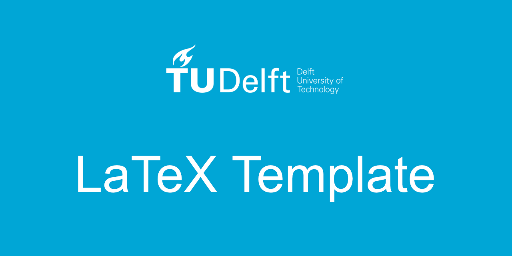

<div align='center'>




An opinionated enhanced version of the TU Delft report LaTeX template.

</div>

## Description

- Fix any potential bugs.
- Make the template more customizable and easy to use, while staying true to the style guide.
- Promote best practices in LaTeX typesetting.

## Installation

### Installation on Windows

The TU Delft LaTeX template has been tested to work with the most recent version
of MiKTeX at the time of this writing (2.9). The following packages are required
on top of a basic MiKTeX installation to make full use of the template:

```console
caption, fancyhdr, filehook, footmisc, fourier, l3kernel, l3packages,
metalogo, mptopdf, ms, natbib, pgf, realscripts, tipa, titlesec, tocbibind,
unicode-math, url, xcolor, xetex-def
```

Note that MiKTeX will generally automatically install these packages if they are
missing from your installation.

### Installation on Linux (Debian/Ubuntu)

Recent versions of Debian, and derived distributions such as Ubuntu, use the TeX
Live system. Install the following packages to make full use of this
template:

```console
texlive, texlive-fonts-extra, texlive-math-extra, texlive-lang-dutch,
texlive-lang-english, texlive-latex-extra, texlive-xetex
```

## Usage

### Using the template

This is the TU Delft LaTeX template for reports and theses. It is designed to
work with all versions of LaTeX, but if you want to adhere to the TU Delft house
style, you need to use XeLaTeX, as it supports TrueType and OpenType fonts. The
document can be compiled with:

```console
xelatex report
bibtex report
xelatex report
xelatex report
```

This is equivalent to selecting `XeLaTeX+BibTeX` or similar in your favorite TeX
editing program.

A sample document, as well as documentation for template options, can be found
in example.pdf. An example with the native LaTeX fonts, compiled using the
`nativefonts` option (or with pdflatex), can be found in
example-nativefonts.pdf.

A separate example document is available which generates a cover image (front,
back, and spine). This document can be generated with:

```console
xelatex cover
xelatex cover
```

Or simply with the `XeLaTeX` option in TeXworks or an equivalent program.

## Build

```console
l3build unpack
```

## Changelog

### Version 0.1.0

- Fixed a few small bugs and removed obsolete packages.
- Added the option to compile with LuaLaTeX.
- Changed the colors to match the current [TU Delft style guide](https://www.tudelft.nl/huisstijl/kleuren).
- Added Affinity palette files.
- Added additional (recommended) packages in the class file.
- Added the AIAA citation style for Aerospace students.
- Added a GitHub social repo card (and template) to the project.
- Added build.lua to split up the creation of the tudelft-report.cls file.
- Added nomenclature, list of figures, list of tables
- Changed the folder/project layout.

## Attribution

Based on the [Overleaf TU Delft LaTeX template by K.P. Hart](https://www.overleaf.com/latex/templates/tud-report/qrntwbrqpckw) released under the Creative Commons CC BY 4.0 license.

Based on the [TU Delft style guide](https://www.tudelft.nl/huisstijl).

## License

[CC-BY-4.0](https://creativecommons.org/licenses/by/4.0/)
